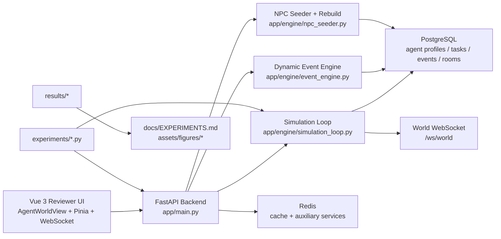
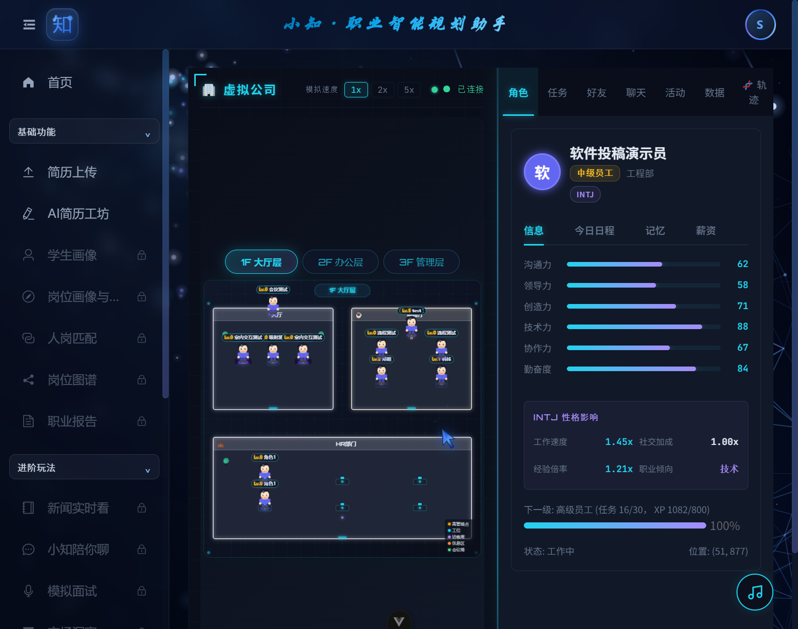

# Virtual Company Simulator for Career Planner

[](https://zenodo.org/badge/latestdoi/1206044980)

This repository stage contains the virtual-company simulator and reproducibility assets prepared for a SoftwareX submission. The artifact focuses on an AI-driven office world in which MBTI-shaped agents work, socialize, join company events, and evolve through a shared simulation loop exposed through a FastAPI backend and a Vue 3 frontend.

The formal SoftwareX submission release for this public artifact is `v1.0.1`.

The public SoftwareX package should be curated from the simulator boundary documented in `docs/softwarex_submission_boundary.md`. This staging branch still lives inside the private monorepo so that the simulator can be stabilized, documented, and exported cleanly.

## Why This Artifact Exists

- Reproduce the virtual-company simulation described in the manuscript.
- Provide a reviewer-friendly runnable demo with diagnostics and NPC recovery endpoints.
- Ship the experiment scripts and baseline outputs needed to validate behavior consistency, ablation, tick latency, and service availability.

## Architecture



## Repository Layout

```text
app/
  engine/                 simulation loop, event engine, NPC seeding, MBTI logic
  routers/                simulation, world, personality, websocket endpoints
src/frontend/
  src/views/AgentWorldView.vue
  src/stores/agentWorld.ts
  src/utils/websocket.ts
experiments/              reproducibility scripts used in the SoftwareX package
results/                  baseline outputs regenerated from the current code
docs/DEPLOYMENT.md        reviewer startup and troubleshooting guide
docs/EXPERIMENTS.md       experiment commands, baselines, and tolerance notes
assets/figures/           screenshot and runtime evidence files
tests/                    virtual-company regression coverage
```

## Requirements

- Docker Desktop with Docker Compose for the one-command reviewer path
- Windows 10/11 or a compatible environment capable of running the provided batch launchers for manual local startup
- Python 3.11+
- Node.js 20+
- PostgreSQL 15+
- Redis 7+

## Quick Start

### 1. Start the full stack with Docker

From the repository root:

```bash
docker compose up --build
```

Canonical Docker URLs:

- Frontend: `http://localhost:5174`
- Backend: `http://localhost:8000`
- OpenAPI docs: `http://localhost:8000/docs`

Registration uses an email verification code. For the full SMTP-backed flow,
copy the `SMTP_*` values from the shared full project `.env` into this
repository's local `.env` before starting Docker. Do not commit real SMTP
credentials.

### 2. Run reviewer smoke checks

After startup, verify:

```bash
curl http://localhost:8000/health
curl http://localhost:8000/api/simulation/status
curl -X POST http://localhost:8000/api/simulation/rebuild-npcs
curl http://localhost:8000/api/simulation/diagnostics
curl -I http://localhost:5174
```

The NPC recovery acceptance gate is:

- `distribution.by_floor` includes non-zero population on `2F`
- `gates.top1_hotspot_ratio_lt_0_40` is `true`

### 3. Optional manual local configuration

Copy `.env.example` to `.env` and fill in at least:

- `SECRET_KEY`
- `ENCRYPTION_KEY_V1`
- `LLM_API_KEY`
- `TIANAPI_KEY`
- `SMTP_HOST`
- `SMTP_PORT`
- `SMTP_USER`
- `SMTP_PASSWORD`
- `SMTP_FROM`

`SMTP_PASSWORD` should be the mailbox authorization code, not the mailbox login password.

Keep `CORS_ORIGINS` on canonical localhost origins such as `http://localhost:5174`.

### 4. Optional manual local startup

```bash
python -m pip install -r requirements.txt
npm install
```

Manual startup is also supported on Windows:

```bat
start.bat
scripts\start_backend.cmd
scripts\start_frontend.cmd
```

Canonical local URLs:

- Frontend: `http://localhost:5174`
- Backend: `http://localhost:8000`
- OpenAPI docs: `http://localhost:8000/docs`

## Simulator API Summary

| Endpoint | Method | Purpose |
| --- | --- | --- |
| `/api/simulation/status` | `GET` | Returns tick counters, speed, and aggregate agent counts |
| `/api/simulation/speed` | `POST` | Adjusts simulation speed multiplier |
| `/api/simulation/seed-npcs` | `POST` | Idempotently seeds NPCs |
| `/api/simulation/rebuild-npcs` | `POST` | Rebuilds NPC records and semantic positions |
| `/api/simulation/diagnostics` | `GET` | Returns runtime fingerprint, floor distribution, hotspots, and acceptance gates |
| `/api/world/map` | `GET` | Returns room geometry and interior metadata |
| `/ws/world` | `WebSocket` | Streams world updates to the frontend |

## Experiments

Formal reproduction scripts live in `experiments/` and current baselines live in `results/`.

These scripts are the experiment-only reproduction mode. They are separate from the full interactive Docker stack above; behavior consistency and ablation can run as lightweight Python-only checks, while tick benchmark and live availability checks use the simulator runtime.

Run all four manuscript-facing experiments:

```bash
python experiments/run_behavior_consistency.py --ticks 1000 --seed 42 --output results/behavior_consistency.csv
python experiments/run_ablation.py --condition all --trials 1000 --seed 42 --output results/ablation.csv
python experiments/run_tick_benchmark.py --warmup 10 --ticks 50 --output results/tick_benchmark.json
python experiments/run_availability_probe.py --duration-seconds 60 --output results/availability.json
```

The full protocol, expected fields, and rerun tolerance notes are documented in `docs/EXPERIMENTS.md`.

## Runtime Evidence

Agent world running screenshot:



Additional reviewer-facing evidence:

- `assets/figures/diagnostics-sample.json`
- `assets/figures/rebuild-npcs-acceptance.json`
- `results/behavior_consistency.csv`
- `results/ablation.csv`
- `results/tick_benchmark.json`
- `results/availability.json`

## Tests

The core virtual-company regression suites are:

```bash
pytest -q tests/test_virtual_company_demo.py tests/test_virtual_company_upgrade.py
```

If you change CORS, login, or captcha behavior, also run:

```bash
pytest -q tests/test_cors_origins.py
pytest -q tests/test_captcha.py
```

## License

This software is released under the MIT License. See `LICENSE`.

## Citation

Citation metadata is provided in `CITATION.cff`. Update the repository URL and manuscript author list if the final public SoftwareX repository uses a different name than this staging branch assumes.

